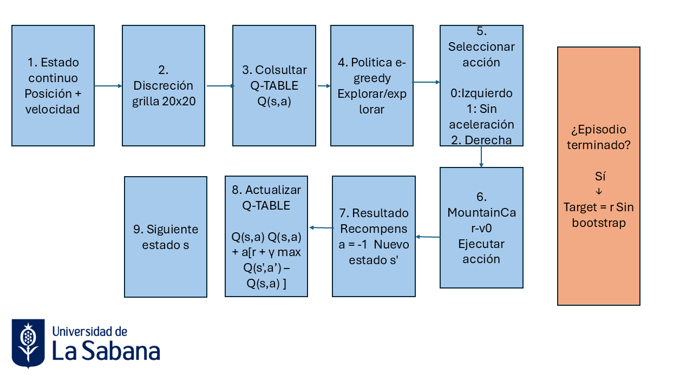
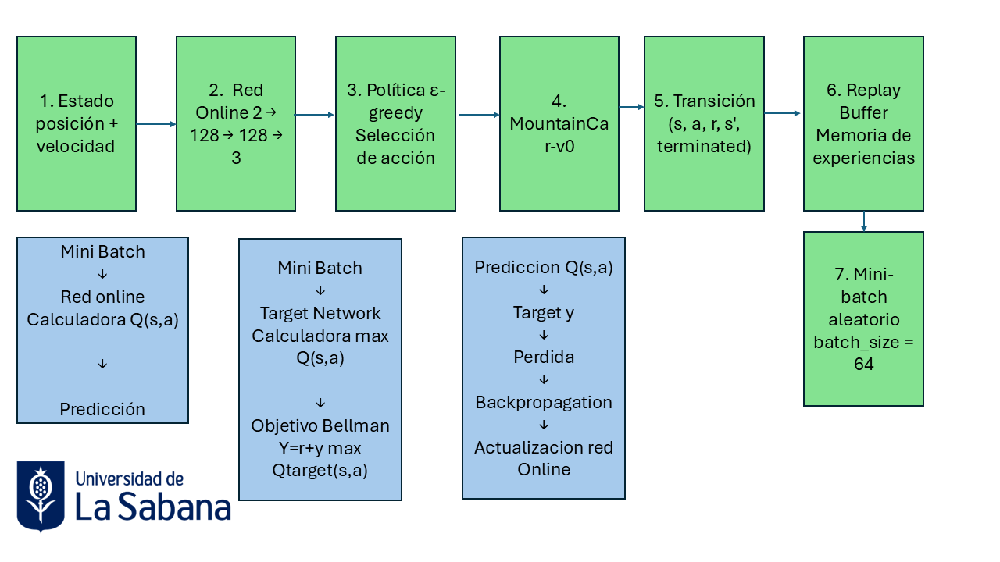
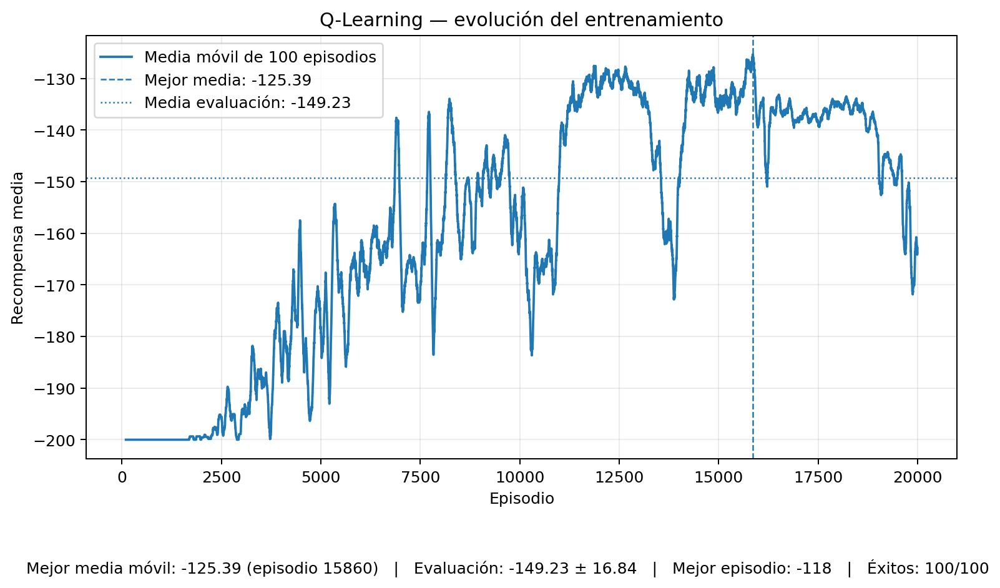
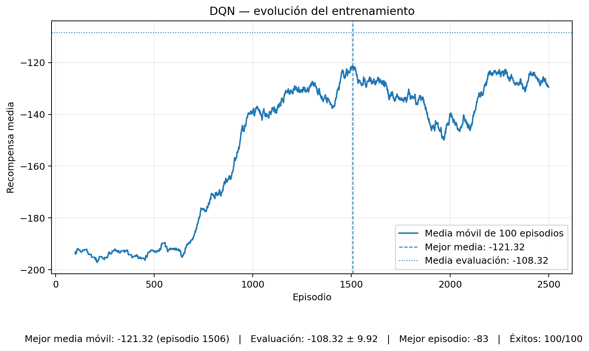
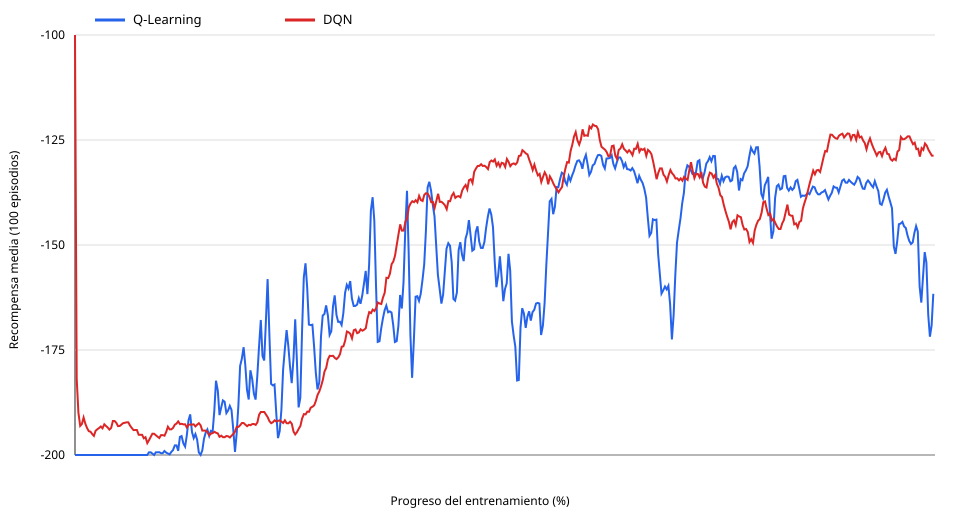

# Taller 1 — MountainCar-v0 con Q-Learning y DQN

Presentado por: 

Ernesto Ilich Contreras Hernandez.
Jesus Gabriel Castillo Malaver.
Noel Eduardo Perez Barrios.
Paola Andrea Roa Molina.
Ruslan Valery Yaya Chujmanov.
Victor Enrique Cantor Beltran.


## Objetivo

Este repositorio implementa y compara dos enfoques de **Aprendizaje por Refuerzo** para resolver el entorno `MountainCar-v0` de Gymnasium:

1. **Q-Learning tabular**, mediante discretización del espacio de estados continuo.
2. **Deep Q-Network (DQN)**, mediante una red neuronal que aproxima la función de valor-acción.

El objetivo es formular el problema como un proceso de decisión secuencial, entrenar ambos agentes bajo condiciones reproducibles y comparar estabilidad, velocidad de aprendizaje, desempeño final, ventajas, limitaciones y costo computacional.

Los resultados medidos y su interpretación se encuentran en [`RESULTADOS.md`](RESULTADOS.md) y en la carpeta [`results/`](results/).

---

## 1. Formulación del problema

`MountainCar-v0` representa un automóvil cuyo motor no tiene potencia suficiente para subir directamente la pendiente derecha. El agente debe aprender a balancearse entre ambos lados del valle para acumular impulso y alcanzar la bandera ubicada en la posición `0.5`.

### Estado u observación

El estado es continuo y contiene dos variables:

| Variable | Descripción | Rango aproximado |
|---|---|---:|
| Posición | Posición horizontal del automóvil | `[-1.2, 0.6]` |
| Velocidad | Velocidad horizontal | `[-0.07, 0.07]` |

### Acciones

| Acción | Significado |
|---:|---|
| `0` | Acelerar hacia la izquierda |
| `1` | No acelerar |
| `2` | Acelerar hacia la derecha |

### Recompensa y objetivo

El entorno entrega una recompensa de `-1` por cada paso ejecutado. Por tanto, el retorno total coincide con el negativo de la duración del episodio: **una recompensa menos negativa representa un mejor desempeño**. El objetivo del agente es alcanzar la bandera usando la menor cantidad posible de pasos.

---

## 2. Q-Learning tabular

El espacio de estados continuo se transforma en una cuadrícula de `20 × 20` celdas. Cada estado discretizado indexa una fila de la tabla Q y cada una de las tres acciones posee un valor estimado.

La selección de acciones usa una política **epsilon-greedy**. Al comienzo del entrenamiento se favorece la exploración; conforme disminuye `epsilon`, aumenta la explotación de los valores aprendidos.

La actualización implementada es:

```text
Q(s,a) <- Q(s,a) + alpha * [r + gamma * max Q(s',a') - Q(s,a)]
```

Cuando el episodio termina por alcanzar el objetivo, no se realiza bootstrap desde el siguiente estado.

### Hiperparámetros

| Parámetro | Valor |
|---|---:|
| Discretización | `20 × 20` |
| Tasa de aprendizaje `alpha` | `0.1` |
| Factor de descuento `gamma` | `0.99` |
| Epsilon inicial | `1.0` |
| Epsilon mínimo | `0.01` |
| Decaimiento de epsilon | `0.9995` |
| Episodios | `20,000` |

### Esquema del entrenamiento de Q-Learning

El flujo de entrenamiento documentado para este agente es el siguiente:

1. Se observa el estado continuo del entorno `(posición, velocidad)`.
2. El estado se discretiza en una grilla de `20 × 20`.
3. Se consultan los valores de la **Q-table** para el estado discretizado.
4. Se selecciona una acción con política **epsilon-greedy**.
5. La acción se ejecuta en el entorno y se obtiene la recompensa `-1`, el nuevo estado y la señal de terminación.
6. Si la transición no es terminal, se actualiza la tabla con `r + gamma * max Q(s', a')`.
7. Si el episodio terminó al alcanzar la meta, la actualización se hace sin bootstrap desde el siguiente estado.
8. El proceso continúa hasta finalizar el episodio y se repite durante todo el entrenamiento.



**Figura 1. Esquema propio del entrenamiento de Q-Learning.** El flujo representa el estado continuo, la discretización, la consulta de la Q-table, la selección de la acción mediante política epsilon-greedy, la interacción con MountainCar-v0, la recompensa y la actualización de los valores Q.


---

## 3. Deep Q-Network (DQN)

DQN utiliza directamente las dos variables continuas del entorno y reemplaza la tabla Q por una red neuronal totalmente conectada:

```text
2 entradas -> 128 ReLU -> 128 ReLU -> 3 valores Q
```

El entrenamiento incorpora dos mecanismos clásicos de estabilización:

- **Experience replay:** almacena transiciones `(s, a, r, s', terminated)` y entrena con mini-lotes aleatorios para reducir la correlación entre muestras consecutivas.
- **Target network:** mantiene una copia separada de la red principal para calcular el objetivo de Bellman y se sincroniza periódicamente.

Para transiciones no terminales, el objetivo utilizado es:

```text
y = r + gamma * max_a' Q_target(s', a')
```

La red principal minimiza el error entre `Q(s,a)` y el objetivo anterior mediante backpropagation.

En este entorno también se utiliza **persistencia temporal de la acción exploratoria durante 20 pasos**, de modo que la exploración pueda producir empujes sostenidos y descubrir trayectorias que acumulen suficiente impulso.

### Hiperparámetros

| Parámetro | Valor |
|---|---:|
| Tasa de aprendizaje | `0.001` |
| Factor de descuento `gamma` | `0.99` |
| Capas ocultas | `2 × 128` |
| Tamaño de lote | `64` |
| Replay buffer | `100,000` transiciones |
| Actualización target network | Cada `10` episodios |
| Epsilon inicial | `1.0` |
| Epsilon mínimo | `0.01` |
| Decaimiento de epsilon | `0.995` |
| Persistencia de acción exploratoria | `20` pasos |
| Episodios | `2,500` |

### Esquema del entrenamiento de DQN

El flujo de entrenamiento documentado para DQN es el siguiente:

1. El estado continuo entra a la **red online**.
2. La acción se selecciona con política **epsilon-greedy** y se ejecuta en el entorno.
3. La transición `(s, a, r, s', terminated)` se almacena en el **replay buffer**.
4. Durante el entrenamiento se muestrean mini-lotes aleatorios de `64` transiciones.
5. La red online calcula `Q(s,a)` para las acciones observadas.
6. La **red objetivo** calcula el objetivo de Bellman `y = r + gamma * max_a' Q_target(s', a')` en transiciones no terminales.
7. Se calcula la pérdida entre la predicción de la red online y el objetivo.
8. La red online se actualiza mediante **backpropagation**.
9. Cada `10` episodios se sincronizan los pesos de la red online con la red objetivo.



**Figura 2. Esquema propio del entrenamiento de DQN.** El flujo representa la red online, la selección epsilon-greedy, la interacción con el entorno, el replay buffer, el mini-lote, la red objetivo, el objetivo de Bellman, la pérdida y la actualización mediante backpropagation.
---

## 4. Resultados reproducibles

La ejecución comparativa utilizó semilla `42`. La evaluación final se realizó sobre **100 episodios** con política determinista y semillas diferentes a las utilizadas durante el entrenamiento.

| Métrica | Q-Learning | DQN |
|---|---:|---:|
| Episodios de entrenamiento | 20,000 | 2,500 |
| Tiempo de entrenamiento registrado | 37.51 s | 317.85 s |
| Mejor media móvil de 100 episodios | -125.39 | -121.32 |
| Episodio de mejor media | 15,860 | 1,506 |
| Recompensa media en evaluación | -149.23 | **-108.32** |
| Desviación estándar en evaluación | 16.84 | **9.92** |
| Mejor episodio evaluado | -118 | **-83** |
| Peor episodio evaluado | -171 | **-115** |
| Éxitos | 100/100 | 100/100 |

### Evidencia de Q-Learning



Q-Learning alcanzó la bandera en los 100 episodios de evaluación. Su recompensa media fue `-149.23`, equivalente a aproximadamente 149 pasos por episodio. Su principal ventaja es la simplicidad y el bajo costo de cada actualización; su principal limitación es la pérdida de resolución introducida por la discretización.

### Evidencia de DQN



DQN también obtuvo 100/100 éxitos y alcanzó una recompensa media de `-108.32`. Frente a Q-Learning utilizó aproximadamente **40.91 pasos menos por episodio**, una reducción de alrededor de **27.4 %**, y presentó menor dispersión en la evaluación.

### Curvas comparativas



El análisis técnico completo se encuentra en [`RESULTADOS.md`](RESULTADOS.md).

---

## 5. Reproducción

### Instalación

```bash
uv sync
```

### Inspección del entorno

```bash
uv run mountaincar inspect --steps 5
```

### Entrenar Q-Learning

```bash
uv run mountaincar train qlearning --episodes 20000
```

### Entrenar DQN

```bash
uv run mountaincar train dqn --episodes 2500
```

### Ejecutar el experimento completo

```bash
uv run python scripts/run_experiments.py
```

El script genera automáticamente:

```text
results/qlearning_training.csv
results/dqn_training.csv
results/summary.json
results/training_curves.svg
```

Las dos figuras PNG de evidencia se regeneran a partir de esos archivos, sin volver a entrenar los agentes, con:

```bash
uv run --with matplotlib python scripts/generate_evidence.py
```

Este segundo script produce:

```text
results/qlearning_evidence.png
results/dqn_evidence.png
```

### Evaluar modelos guardados

```bash
uv run mountaincar load qlearning --eval
uv run mountaincar load dqn --eval
```

---

## 6. Estructura del repositorio

```text
.
├── README.md
├── RESULTADOS.md
├── EXERCISES.md
├── pyproject.toml
├── uv.lock
├── scripts/
│   ├── run_experiments.py
│   └── generate_evidence.py
├── src/mountain_car/
│   ├── cli.py
│   └── agents/
│       ├── qlearning.py
│       └── dqn.py
├── results/
│   ├── qlearning_training.csv
│   ├── dqn_training.csv
│   ├── summary.json
│   ├── training_curves.svg
│   ├── qlearning_evidence.png
│   └── dqn_evidence.png
└── docs/
    ├── esquema_qlearning.png
    └── esquema_dqn.png
```

---

## 7. Conclusión

Ambos agentes aprendieron una política capaz de resolver `MountainCar-v0` en el 100 % de los episodios de evaluación. Q-Learning ofreció una solución sencilla, interpretable y computacionalmente económica, pero dependiente de la discretización del estado. DQN utilizó las observaciones continuas y obtuvo un desempeño final superior, con una recompensa media de `-108.32` frente a `-149.23` de Q-Learning, a cambio de un mayor costo computacional y una implementación más compleja.

El experimento evidencia la transición entre un método tabular clásico y una aproximación de Deep Reinforcement Learning: la red neuronal permite generalizar entre estados continuos, mientras que experience replay y target network estabilizan el proceso de aprendizaje.
